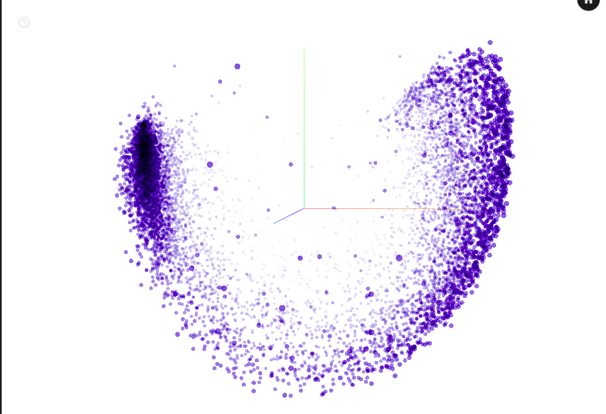
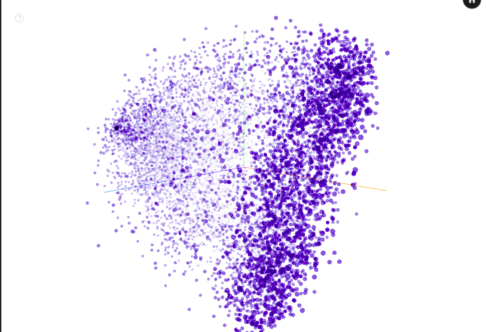
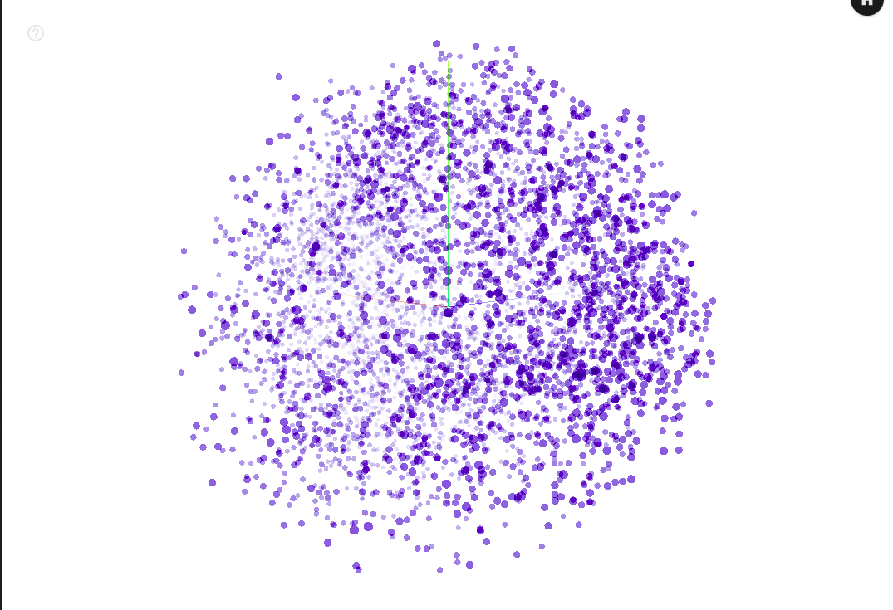
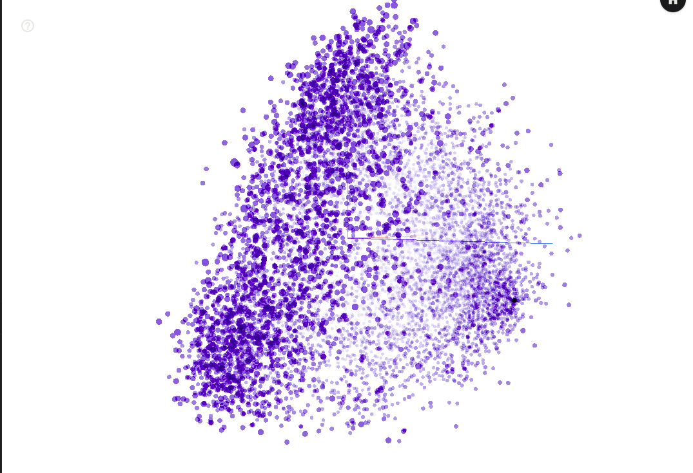
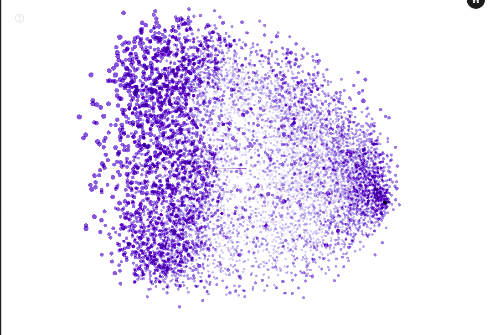
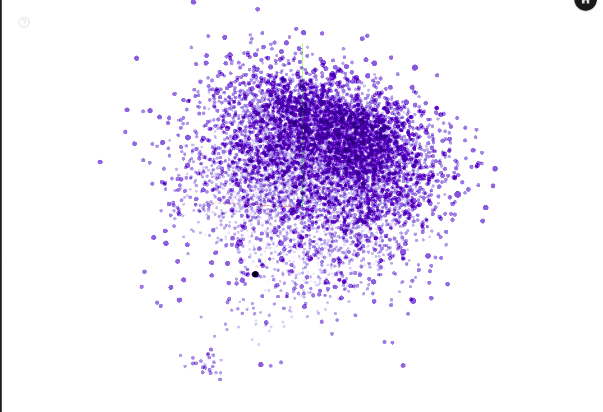
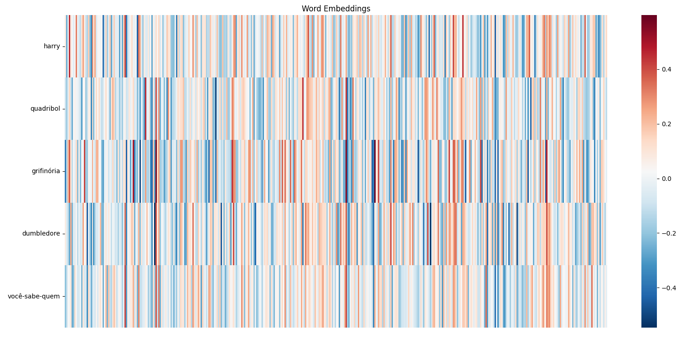
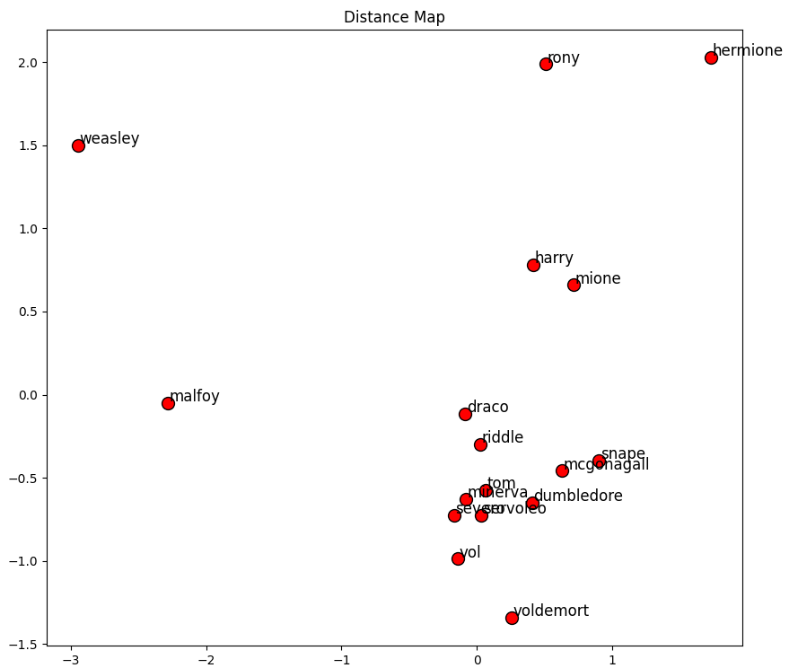

# TPC4
**Titulo:** Semana 8  
**Id:** PG60298  
**Nome:** Rafael Santos Fernandes  
**Data:** 2026-04-13  

## Resumo
Este trabalho incidiu sobre a construção de um modelo Word2Vec sobre dados extraídos de livros da série Harry Potter.

## Resultados
## 1. Extração de Texto
### 1.1. Informação Alvo 
É pretendido extraír dos livros "Harry Potter e A Pedra Filosofal.txt" e "Harry_Potter_Camara_Secreta-br.txt" os _word embeddings_ existentes nos textos-fonte.  

### 1.2. Análise da Estrutura 
Comecei por analisar o ficheiro "Harry_Potter_Camara_Secreta-br.txt" de modo a perceber a estrutura do texto, tirando as seguintes conclusões:  
- Os capítulos estão escritos exclusivamente em letras maiúsculas e identados em relação ao restante texto (salvo título do capítulo, ver abaixo). O subtexto contendo o identificador do capítulo encontra-se entre dois caráteres `-` ou `—`, não necessáriamente emparelhados.  
- O título do capítulo encontra-se, de igual modo, identado á esquerda em relação ao restante texto. O título encontra-se imediatamente a seguir ao identificador do capítulo.  
O restante texto encontra-se dividido em parágrafos, possivelmente quebrados em várias linhas. Linhas de diálogo começam obrigatóriamente com um caráter `—`, porém o mesmo carátere é por vezes utilizado a meio de uma frase para mudança de contexto. Existe por vezes espaço á direita do texto no fim de cada linha.  
Analisei de seguida o ficheiro "Harry_Potter_Camara_Secreta-br.txt", tirando as seguintes conclusões:  
- O ficheiro começa com uma grande quantidade de texto irrelevante, como dados de copyright, metainformação sobre o livro e índice.  
- O índice contém cada capítulo com a mesma estrutura de cada identificador de capítulo no restante texto.  
Cada identificador de capítulo começa e termina obrigatoriamente com o caráter `—`. O título do capítulo segue-se imediatamente a seguir.  
O restante conteúdo de cada capítulo segue as mesmas regras do livro anterior.  
O caráter ***form feed*** (`0x0C`, `^L`) separa o texto de cada página física do livro scaneado, que pode quebrar tanto capítulos como o texto do mesmo.  

### 1.3. Detalhes de implementação 
Para o tratamento de ambos os textos-fonte, foi utilizado um script `bash`, com recurso ás _built-ins_ do mesmo, bem como as ferramentas externas comuns `cat`, `sed` e `perl`.  

## 2. Geração do Modelo
### 2.1. Detalhes de implementação 
- A biblioteca `spaCy` é utilizada para tokenizar cada texto-fonte. É utilizado o modelo pt_core_news_sm para identificar as frases no texto e separar as mesmas em palavras (ver capítulos `Teste de Hiperparâmetros`).  
- Foram testadas múltiplas combinações dos parâmetros `vector_size`, `min_count` e `epochs`, antes de chegar ao valor final (400, 1 e 15, respetivamente).  

### 2.2. Problemas Encontrados 
Durante a fase de testes foi identificado um problema na tokenização do texto-fonte que ocorre devido ao spaCy unificar preposições (e.g. `de o`) num único token, que seria passado com o caráter de espaço ao modelo, o que levava a um ficheiro no formato Word2Vec incorreto.  

## 3. Teste do Modelo
### 3.1. Testes de Hiperpârametros 

- **Hiperparâmetros**: `vector_size=100`, `min_count=1`, `epochs=5`  
- **Variância**: 92.1%  
> **Nota:** Overfitting  

### 3.2. Testes de Hiperpârametros 

- **Hiperparâmetros**: `vector_size=100`, `min_count=1`, `epochs=15`  
- **Variância**: 55.3%  

### 3.3. Testes de Hiperpârametros 

- **Hiperparâmetros**: `vector_size=100`, `min_count=2`, `epochs=15`  
- **Variância**: 44.1%  

### 3.4. Testes de Hiperpârametros 

- **Hiperparâmetros**: `vector_size=100`, `min_count=1`, `epochs=15`  
- **Variância**: 56.4%  

### 3.5. Testes de Hiperpârametros 

- **Hiperparâmetros**: `vector_size=400`, `min_count=1`, `epochs=15`  
- **Variância**: 60.1%  
> **Nota:** Aumentar o hiperparâmetro `vector_size` aparenta aumentar a qualidade do modelo.  

### 3.6. Testes de Hiperpârametros 

- **Hiperparâmetros**: `vector_size=200`, `min_count=1`, `epochs=100`  
- **Variância**: 11.3%  
> **Nota:** Aumentar o hiperparâmetro `epochs` aparenta reduzir significamente a qualidade do modelo.  

### 3.7. Testes Analíticos 
Para a bateria de testes, foram utilizados os métodos `most_similar`, `similarity` e `doesnt_match` do modelo. O método `most_similar` foi utilizado também para testar analogias.  
- **Notas:**  
  - O token `vol` é associado a `voldemort` por ser referênciado por elipse no texto-fonte.  
  - Curiosamente, os token `ojesed` e `espelho` não possúem a maior correlação, apesar do segundo aparecer em todas as menções do primeiro.  

### 3.8. Figura 1 

_Heatmap_ de _Word Embeddings_  

### 3.9. Figura 2 

Mapa de distâncias entre seletas palavras  

## 4. Scripts
### 4.1. preproc.sh 
Criado para preprocessar ambos os textos-fonte de modo a normalizar a sua estrutura antes de serem consumidos pela ferramenta de geração do modelo Word2Vec.  
> **Ficheiro relacionado:** [./preproc.sh](./preproc.sh)
### 4.2. harry_makemodel.py 
Criado para carregar os textos-fonte preprocessados, gerar um modelo Word2Vec e exportá-lo em diversos formatos.  
> **Ficheiro relacionado:** [./harry_makemodel.py](./harry_makemodel.py)
### 4.3. harry_usemodel.py 
Criado para carregar o modelo gerado anteriormente e testar o mesmo.  
> **Ficheiro relacionado:** [./harry_usemodel.py](./harry_usemodel.py)

